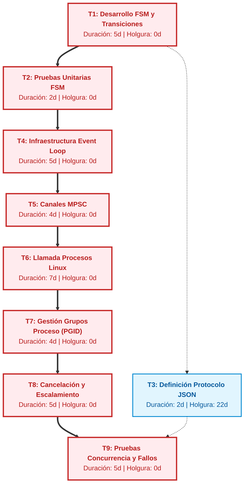

# Cronograma de desarrollo SpeedyG
El archivo se llama cronograma pero tecnicamente es un roadmap de ruta critica :)

| ID  | Tarea   | Dependencia | Duración (en días) |
|:--- |:---------------:|:-------:|:---:|
|1    | Desarrollo FSM y sus transiciones | - | 5 |
|2    | Pruebas unitarias FSM | 1 | 2 |
|3    | Definición de Protocolo JSON | 1 | 2 |
|4    | Infraestructura del Event Loop | 2 | 5 |
|5    | Canales de Comunicación MPSC | 4 | 4 |
|6    | Llamada de Procesos Linux | 5 | 7 |
|7    | Gestión de Grupos de Proceso | 6 | 4 |
|8    | Lógica de Cancélación y Escalamiento | 7 | 5 |
|9    | Pruebas de Concurrencia e Inyección de Fallos | 3, 8 | 5 |

# Roadmap de Desarrollo Técnico - SpeedyG (versión grafica)

