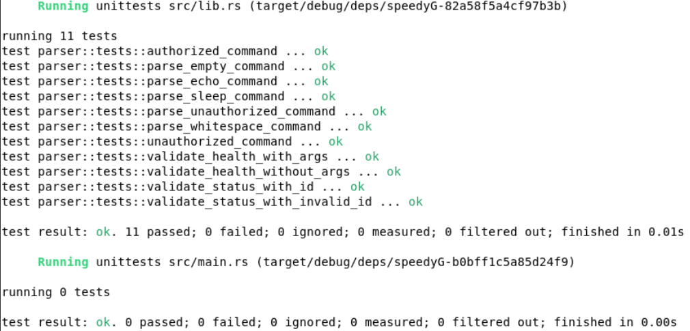
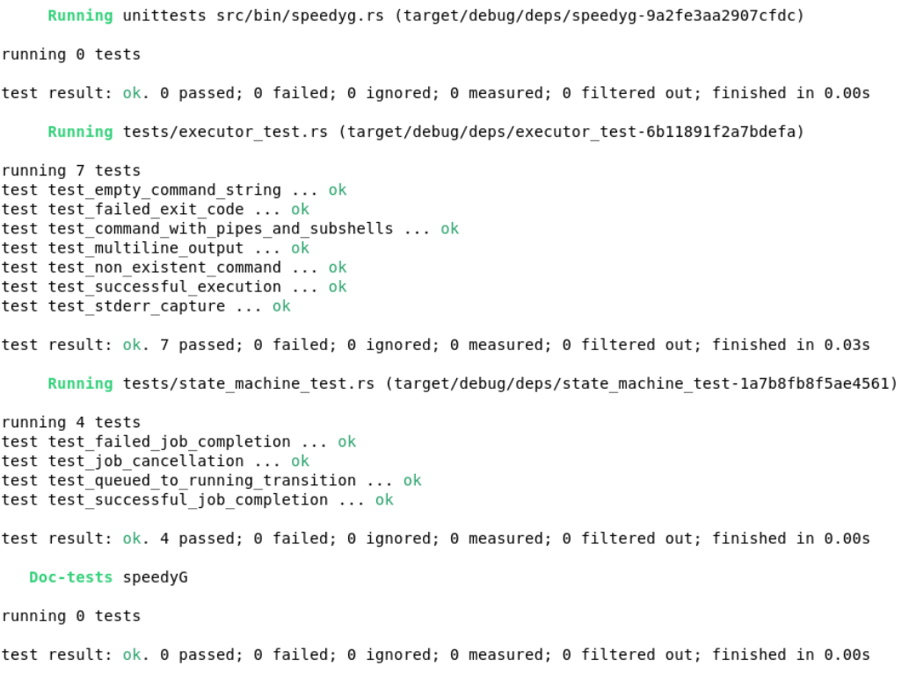
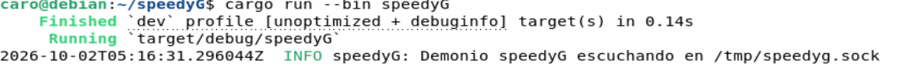
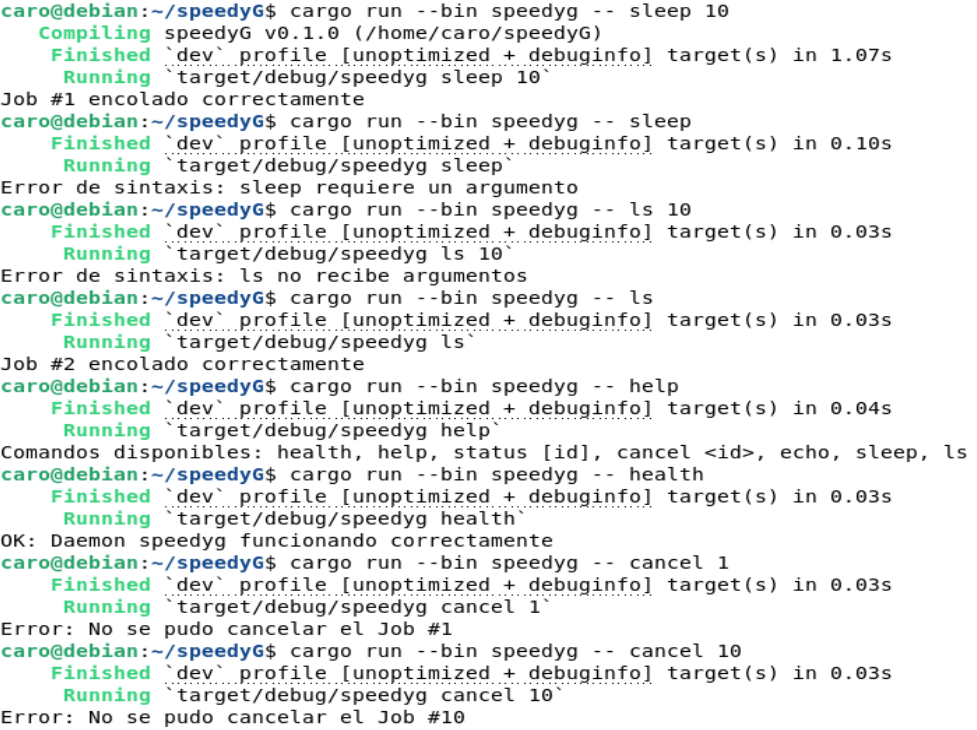
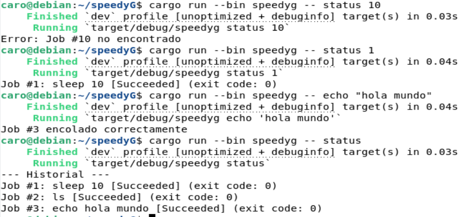

# Ejecución formal - Avance 1

## Versión 
Commit: 89acfdc

## Entorno
- Sistema operativo: Debian 13
- Lenguaje: Rust 1.98.1

## Configuración
No se establecieron configuraciones adicionales para pruebas manuales. Se utilizaron valores preestablecidos para pruebas automatizadas 
## Comandos ejecutados

### Pruebas automatizadas

| Comando | Propósito |
|---|---|
|`cargo test`|Ejecutar las pruebas automatizadas de la máquina de estados, parser y executor 

### pruebas manuales
| Comando | Propósito |
|---|---|
|`cargo run --bin speedyG` | Iniciar el daemon |
|`cargo run --bin speedyg -- sleep 10` | Ejecutar un trabajo `sleep`|
|`cargo run --bin speedyg -- sleep` | Ejecutar un trabajo `sleep` sin argumento, debe rechazarlo|
|`cargo run --bin speedyg -- ls 10` | Ejecutar un trabajo `ls` con argumento|
|`cargo run --bin speedyg -- ls ` | Ejecutar un trabajo `ls` sin argumento|
|`cargo run --bin speedyg -- help` | Comprobar el comando de ayuda |
|`cargo run --bin speedyg -- health` | Comprobar el comando de estado del servicio |
|`cargo run --bin speedyg -- cancel 1` | Solicitar la cancelación del trabajo con ID 1, debe de negarlo al haber sido finalizado |
|`cargo run --bin speedyg -- cancel 10` | Solicitar la cancelación del trabajo con ID inexistente, debe rechazarlo |
|`cargo run --bin speedyg -- status 10` | Consultar un trabajo con ID inexistente, debe rechazarlo |
|`cargo run --bin speedyg -- status 1` | Consultar un trabajo con ID 1 |
|`cargo run --bin speedyg -- echo "hola mundo"` | Ejecutar `echo` con un argumento|
|`cargo run --bin speedyg -- status` | Consultar todos los trabajos existentes |

## Resultados
### Pruebas automatizadas
| Prueba | Resultado |
|---|---|
| Máquina de estados | PASS |
| Parser | PASS |
| Executor |PASS |

### pruebas manuales
| Prueba | Resultado |
|---|---|
| Iniciar el daemon | PASS |
| Ejecutar un trabajo `sleep` con argumento| PASS |
| Ejecutar un trabajo `sleep` sin argumento, debe rechazarlo| PASS |
| Ejecutar un trabajo `ls` con argumento| FAILED - debería de aceptarlo pero se puso como regla que no recibiera argumentos |
| Ejecutar un trabajo `ls` sin argumento| PASS |
| Comprobar el comando de ayuda | PASS | 
| Comprobar el comando de estado del servicio | PASS |
| Solicitar la cancelación del trabajo con ID 1, debe de negarlo al haber sido finalizado | PASS |
| Solicitar la cancelación del trabajo con ID inexistente, debe rechazarlo | PASS |
| Consultar un trabajo con ID inexistente, debe rechazarlo | PASS |
| Consultar un trabajo con ID 1 | PASS |
| Ejecutar `echo` con un argumento | PASS |
| Consultar todos los trabajos existentes | PASS |

## Bitácora 

Se anexan evidencias de las pruebas automatizadas y manuales

## Resumen 

Se realizaron las pruebas automatizadas y manuales correspondientes al Avance 1. La gran mayoria de las pruebas manuales fueron satisfactorias. Se identificó un fallo en la ejecución de ls con argumentos, debido a que actualmente el parser indica que este comando no debe recibir argumentos. El resto de funcionalidades probadas presentó los resultados esperados 
